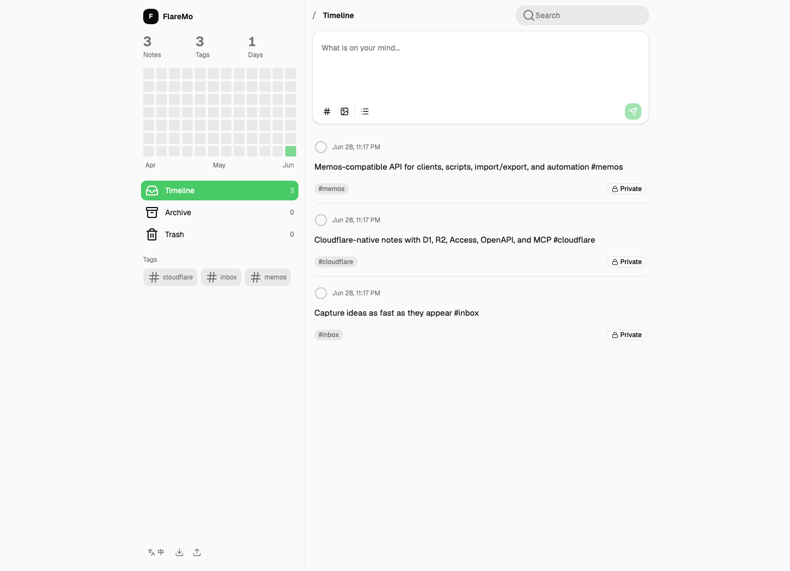
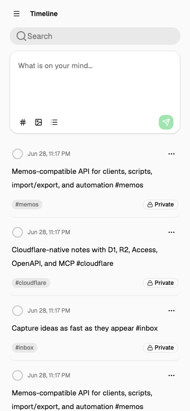

# FlareMo

**A Cloudflare-native personal knowledge system that can run all day on a free Cloudflare account. It ships with D1, R2, Cloudflare Access, a quiet memo timeline, and a Memos-compatible API subset.**

[](https://github.com/realchendahuang/FlareMo)
[](./LICENSE)
[](https://www.cloudflare.com/)
[](https://github.com/usememos/memos)

[中文 README](./README.md)

[](https://deploy.workers.cloudflare.com/?url=https://github.com/realchendahuang/FlareMo)

<p>
  
  
</p>

The screenshots show the current backend-backed timeline, editor, filtering, and mobile navigation. Features that are not implemented yet, such as AI review, semantic search, and messaging-app capture, are not exposed as placeholder UI.

## What It Does

- Quick memo capture with tags and attachments.
- Timeline, archive, trash, search, tag filtering, and activity heatmap.
- R2-backed attachments.
- Public share links.
- Memos-style import and export.
- Memos-compatible `/api/v1` memo, attachment, relation, share, import/export, OpenAPI, and MCP subset.
- Chinese and English interface.

FlareMo keeps the UI honest: if a feature is not wired to the backend, it does not appear as a fake entry point.

## Deployment

### Deploy Button

Click the Deploy to Cloudflare button above. Cloudflare reads `wrangler.jsonc`, creates a Worker, and provisions the required D1 and R2 bindings.

After the first deployment, apply D1 migrations:

```bash
pnpm migrate:remote
```

If your Cloudflare Dashboard has not connected GitHub or GitLab yet, Cloudflare will ask you to connect a Git provider first. That OAuth step happens in Cloudflare. FlareMo does not ask for an app-level token.

### Agent Deployment

Use [docs/en/agent-deploy.md](./docs/en/agent-deploy.md) or the Chinese [docs/agent-deploy.md](./docs/agent-deploy.md) with Codex, Claude Code, Cursor Agent, or another command-capable agent.

### Manual Deployment

```bash
pnpm install
pnpm exec wrangler d1 create flaremo
pnpm exec wrangler r2 bucket create flaremo-attachments
```

Write the generated D1 `database_id` into `wrangler.jsonc`, then run:

```bash
pnpm verify
pnpm deploy:dry-run
pnpm migrate:remote
pnpm deploy
```

Full deployment docs: [docs/en/deploy.md](./docs/en/deploy.md).

### Pre-deployment Checklist

- Wrangler is logged in to the target Cloudflare account: `pnpm exec wrangler whoami`.
- `wrangler.jsonc` uses `DB` as the D1 binding and contains the target D1 `database_id`.
- `wrangler.jsonc` uses `ATTACHMENTS` as the R2 binding, and the target bucket exists.
- Remote D1 migrations will be applied after the first deploy: `pnpm migrate:remote`.
- Cloudflare Access policies are planned for human access, Service Tokens, and public share bypass routes.
- The release gate has passed: `pnpm verify` and `pnpm deploy:dry-run`.

## Auth Boundary

Production access belongs to Cloudflare Access:

- Humans use an Access identity policy.
- Scripts, MCP, and Memos-compatible clients use Access Service Tokens.
- Public share routes should have an explicit Access bypass policy.

FlareMo does not issue app-level Bearer tokens and does not keep an instance login page.

Script example:

```bash
curl "$FLAREMO_URL/api/v1/memos" \
  -H "CF-Access-Client-Id: $FLAREMO_ACCESS_CLIENT_ID" \
  -H "CF-Access-Client-Secret: $FLAREMO_ACCESS_CLIENT_SECRET"
```

## Tech Stack

- Runtime: Cloudflare Workers
- Web: React, Vite, Tailwind CSS, shadcn/radix primitives
- API: Hono-style Worker routes, Zod contracts, OpenAPI
- Database: Cloudflare D1, Drizzle
- Object storage: Cloudflare R2
- Auth boundary: Cloudflare Access
- Package manager: pnpm

D1 is the source of truth for notes, users, relations, shares, settings, and attachment metadata. R2 stores only binary objects and export bundles.

## Memos Compatibility

FlareMo uses Memos as an ecosystem anchor, not as an internal server fork. The compatibility layer is an adapter over FlareMo domain services.

Current docs:

- [Memos compatibility matrix](./docs/en/memos-compatibility.md)
- [Memos ecosystem matrix](./docs/memos-ecosystem.md)
- [Semantic search architecture](./docs/semantic-search.md)
- [OpenAPI](./packages/contracts/src/openapi.ts)

The important auth detail is Cloudflare Access. A third-party Memos client must be able to send these headers to talk to a protected production FlareMo instance:

```text
CF-Access-Client-Id
CF-Access-Client-Secret
```

## Development

```bash
pnpm install
pnpm migrate:local
pnpm dev
```

Local URL:

```text
http://localhost:8787
```

Quality gate:

```bash
pnpm verify
pnpm deploy:dry-run
```

Maintenance commands:

```bash
pnpm format:check
pnpm screenshots
pnpm backup:drill
pnpm release vX.Y.Z
```

The project does not use GitHub Actions as CI. Maintainers run the local release gate before publishing.

## Contributing

Read [CONTRIBUTING.md](./CONTRIBUTING.md), [SUPPORT.md](./SUPPORT.md), [SECURITY.md](./SECURITY.md), and [ROADMAP.md](./ROADMAP.md).

## License

MIT
